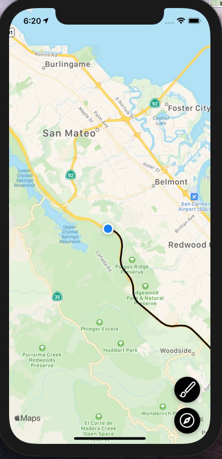

# Lugares App

## Descripción

> ### Aplicación realizada con React Native dedicada a trabajar con mapas

## Imagen

## Lo Aprendido

- Implementar Mapas en React Native
- Pedir permisosen Android e iOS
- Trabajar con Google Maps y Apple Maps
- Implementar Polylines para el trazado de rutas

## Como Ejecutar

- Ejecuta `cd RNRutasApp`
- Ejecuta `yarn install`
- Si lo ejecutas para iOS `npx pod-install && npx react-native run-ios`
- Si lo ejecutas para Android `npx react-native run-android`
